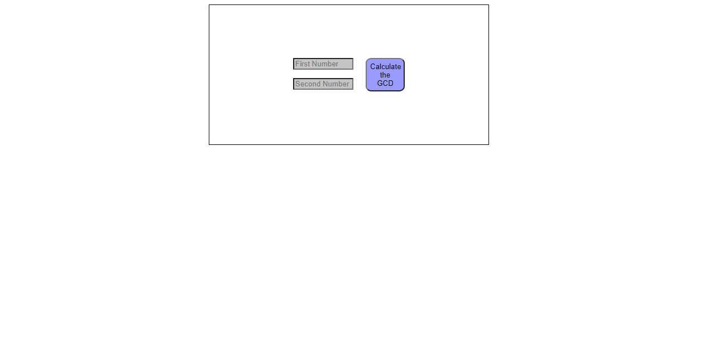
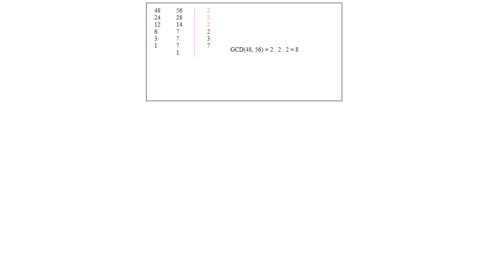

<!-- BODY -->
# Greatest Common Divisor (GCD) Calculator

<!-- PROJECT IMAGES -->
## Project Images

### Project Image - 1


### Project Image - 2


### Project Image - 3


<br/>

<!-- ABOUT THE PROJECT -->
## About The Project
I developed this project to improve myself in JavaScript, HTML, CSS and calculate the greatest common divisor in a simple and understandable way for the user. When the user enters the appropriate numbers into the inputboxes, the program automatically adjusts a scheme and calculates the greatest common divisor.

<br/>

<!-- Technologies Used -->
## Technologies Used

This project is developed with the followings:

* [JavaScript](https://www.javascript.com)
* HTML
* CSS

<br/>

<!-- Setup/Installation -->
## Setup/Installation
 Clone the repository 
   ```sh
   git clone https://github.com/dyakupoglu/Greatest-Common-Divisor-Calculator.git
   ```

<br/>

<!-- LICENSE -->
## License

Distributed under the MIT License. See `LICENSE.txt` for more information.
